# OpenED — Comprehensive Product Specification

**The Learning Engine That Makes Education Stick**

March 2026 • Confidential • Version 4.0

> Wireframes • Database schemas • API definitions • User journeys • Session generation logic • All locked decisions

---

## 1. Executive Summary

OpenED is a creator marketplace learning platform combining spaced repetition (FSRS v5), Duolingo-style gamification, and a two-sided creator marketplace. Creators upload raw educational content as files (CSV, XLSX, JSON, PDF, DOCX). The platform processes and transforms it into adaptive, gamified study sessions optimized for retention and exam readiness.

**Mission:** Free to learn. Fair to create. Built to last.

**Core model:** Creators supply content, OpenED provides the adaptive learning engine. Spotify for learning — creators earn proportional to engagement.

**Three target markets:**
- **Professional certifications (beachhead):** CompTIA, AWS, Cisco, PMI
- **Academic and cultural education (expansion):** Museums, universities, K-12
- **Enterprise training (premium):** AI companies, SaaS, DoD contractors

**Key differentiator:**
No existing platform combines gamification + spaced repetition + creator marketplace + mobile-first. Duolingo has no creators. Udemy has no spaced repetition. Anki has no gamification. OpenED combines all four.

---

## 2. Strategic Decisions

| Pivot | From | To |
|-------|------|-----|
| Content model | Build 500 AI questions ourselves | Creator marketplace |
| Name | CertPath | OpenED (working name — trademark issue, see Section 20) |
| Scope | Cert prep only | Three markets (certs, academic, enterprise) |
| Platform | Web app only | Web + Native simultaneous launch |

---

## 3. Tech Stack (Locked)

| Layer | Technology | Notes |
|-------|-----------|-------|
| Web frontend | Next.js 14+ (App Router) | SSR for SEO, creator portal |
| Mobile frontend | Expo / React Native | Simultaneous launch |
| Shared logic | @opened/core TypeScript package | FSRS, XP, session logic |
| Styling (web) | Tailwind CSS | |
| Backend / API | Next.js API Routes + Server Actions | No separate backend |
| Database | Supabase (PostgreSQL) | RLS, auth, real-time |
| Auth | Supabase Auth (client SDK) | No custom auth wrappers |
| AI processing | Claude API (Sonnet) | Content enrichment, classification |
| File storage | Supabase Storage | Uploads, thumbnails, avatars |
| Hosting | Vercel (web) + EAS (mobile) | |
| State management | Zustand | Both platforms |

---

## 4. Content Structure (Locked)

**Course → Module → Topic → Question**

| Level | Description | Example (Security+) | Minimum |
|-------|------------|---------------------|---------|
| Course | Top-level product | CompTIA Security+ SY0-701 | — |
| Module | Major divisions (exam domains) | Domain 4: Security Operations | 3+ per course |
| Topic | Sub-objectives | 4.3: Security automation | 3+ per module |
| Question | Atomic unit (FSRS operates here) | Individual MCQ | 10+ per topic, 50+ per course |

- Session size: ~10 questions, 5-8 minutes
- Minimums enforced in app logic at submit-for-review (not DB constraints)
- `guidebook_content`: TEXT nullable on courses, modules, AND topics
- `weight_percent` on modules: nullable, readiness score calculation ONLY

---

## 5. Question Types

**MVP (locked):**
- `multiple_choice` — 4 options, 1 correct
- `multiple_select` — 4-6 options, 2+ correct
- `true_false` — binary choice

**Tier 2:**
- `fill_blank`, `ordering`

**Deferred:**
- `matching`, `hotspot`, `drag_drop`

---

## 6. FSRS Spaced Repetition Algorithm (Locked)

| Parameter | Value | Rationale |
|-----------|-------|-----------|
| Algorithm | FSRS v5 | 15-30% more efficient than SM-2, eliminates ease hell |
| Rating buttons | 2 primary (Again/Good) + optional Easy | Reduces decision fatigue |
| Target retention | 90% default | Standard FSRS default |
| Maximum interval | 365 days | Cap at 1 year |
| Fuzz factor | ±10% jitter | Prevents review clustering |
| Session size | 10 questions default | 5-8 minute target |

### 6.1 Session Generation — 3 Pools

- **Pool 1 (60%):** Due reviews — FSRS-driven from anywhere in course. Query: `user_card_states WHERE due_date <= TODAY`, ordered most overdue first.
- **Pool 2 (25%):** Weak topic fill — new unseen cards from lowest-scoring topic already started.
- **Pool 3 (15%):** New cards — from learner's current topic on linear path, easier questions first.

**Session composition over time:**
Early sessions: Pool 1 nearly empty (few reviews due), backfill with new cards. As user progresses: Pool 1 dominates — most of session is reviewing at the optimal moment before forgetting.

**Example session (2 weeks into Security+):**

| # | Question | Pool | Why |
|---|----------|------|-----|
| 1 | What is AES? | Pool 1 (review) | Seen 5 days ago, due today |
| 2 | Phishing vs vishing? | Pool 1 (review) | Got wrong last time, due today |
| 3 | What is pretexting? | Pool 1 (review) | Seen 10 days ago, due today |
| 4 | Defense in depth? | Pool 1 (review) | Seen 8 days ago, due today |
| 5 | CIA triad? | Pool 1 (review) | Seen 14 days ago, overdue |
| 6 | Symmetric vs asymmetric? | Pool 1 (review) | Seen 3 days ago, due today |
| 7 | Tailgating definition? | Pool 2 (weak) | Weakest topic: social engineering |
| 8 | Watering hole attack? | Pool 2 (weak) | New question, same weak topic |
| 9 | Shoulder surfing? | Pool 2 (weak) | New question, same weak topic |
| 10 | What is a VLAN? | Pool 3 (new) | Next unseen on current path topic |

### 6.2 Path UI vs FSRS Relationship

- **Path = topic-level progress.** Deterministic linear order (1.1 → 1.2 → 2.1 etc). Topic unlocks when readiness hits ~70%.
- **FSRS = question-level scheduling.** Decides which specific questions appear in each session. Mixes reviews from old topics + new cards from current topic.
- Path doesn't change based on FSRS. FSRS doesn't change path order. They operate at different levels.
- **Duolingo comparison:** Their path IS the schedule (review interleaved into path). Our path shows mastery; sessions handle review independently. Better for cert prep where topics have fixed boundaries.

### 6.3 Readiness Score

Weighted average of topic scores × module `weight_percent`. Recalculated after every session. Stored on `user_courses.readiness_score`.

---

## 7. Creator Flow (Locked)

| Step | What happens | Gate? |
|------|-------------|-------|
| 1. Apply | Name, bio, planned content, credentials | — |
| 2. Wait for approval | Manual review, 24-48 hrs | **GATE 1: Creator approved** |
| 3. Enter course info | Title, description, category, pricing, cert fields | — |
| 4. Upload content | Drag/drop CSV, XLSX, JSON, PDF, DOCX files | — |
| 5. Processing | System organizes into Course → Module → Topic → Question | — |
| 6. Creator review | Review structure, edit questions, fix warnings | — |
| 7. Submit for review | Course enters review queue | — |
| 8. Course approved | Goes live to learners | **GATE 2: Course approved** |

**Key decisions:**
- Two gates: creator approval (cost control on AI infrastructure) + course approval (content quality)
- Content always created externally and uploaded as files — no paste box, no in-app authoring
- Supported formats: CSV, XLSX, JSON, PDF, DOCX, TXT. Downloadable templates provided.
- File size limit: 50MB per file, no per-course cap
- Published courses can be edited freely — no re-review required (matches Udemy policy)

---

## 8. Database Schema — 9 MVP Tables

6 creator-side tables + 3 learner-side tables. Supabase PostgreSQL with Row Level Security. UUIDs as primary keys. Timestamps in UTC.

### 8.1 profiles

Extends Supabase `auth.users`. Auto-created via DB trigger on signup.

| Column | Type | Notes |
|--------|------|-------|
| id | UUID PK | References auth.users.id |
| display_name | TEXT | |
| avatar_url | TEXT | nullable |
| role | ENUM | `learner \| creator \| admin`. Default: learner |
| timezone | TEXT | Default: America/Los_Angeles |
| onboarding_complete | BOOLEAN | Default: false |
| created_at | TIMESTAMPTZ | Default: now() |
| updated_at | TIMESTAMPTZ | Auto-updated via trigger |

### 8.2 creators

Created when a user applies (status: pending). Updated to approved by admin.

| Column | Type | Notes |
|--------|------|-------|
| id | UUID PK | |
| user_id | UUID FK UNIQUE | → profiles.id |
| creator_name | TEXT | Public display name |
| bio | TEXT | nullable |
| expertise_areas | TEXT[] | e.g. ['cybersecurity', 'comptia'] |
| credentials | TEXT | nullable |
| status | ENUM | `pending \| approved \| suspended` |
| created_at | TIMESTAMPTZ | |

### 8.3 courses

Marketplace product. Cert fields required when category = certification (app logic).

| Column | Type | Notes |
|--------|------|-------|
| id | UUID PK | |
| creator_id | UUID FK | → creators.id |
| title / slug | TEXT / TEXT UNIQUE | |
| description | TEXT | |
| guidebook_content | TEXT | nullable |
| category | ENUM | `certification \| academic \| professional \| general_knowledge \| institutional` |
| difficulty | ENUM | `beginner \| intermediate \| advanced` |
| thumbnail_url | TEXT | nullable |
| is_free / price_cents | BOOLEAN / INTEGER | |
| exam_fee_cents | INTEGER | nullable. Required if cert. |
| passing_score / max_score | INTEGER / INTEGER | nullable. Required if cert. |
| exam_duration_minutes | INTEGER | nullable. Required if cert. |
| total_questions_on_exam | INTEGER | nullable. Required if cert. |
| provider_name / provider_url | TEXT / TEXT | nullable. Required if cert. |
| status | ENUM | `draft \| in_review \| published \| archived` |
| published_at | TIMESTAMPTZ | nullable |
| created_at / updated_at | TIMESTAMPTZ | |

### 8.4 modules

| Column | Type | Notes |
|--------|------|-------|
| id | UUID PK | |
| course_id | UUID FK | → courses.id |
| title / description | TEXT / TEXT | description nullable |
| guidebook_content | TEXT | nullable |
| weight_percent | INTEGER | nullable. Readiness score only. |
| display_order | INTEGER | |
| created_at | TIMESTAMPTZ | |

### 8.5 topics

| Column | Type | Notes |
|--------|------|-------|
| id | UUID PK | |
| module_id / course_id | UUID FK | course_id denormalized |
| title / description | TEXT / TEXT | description nullable |
| guidebook_content | TEXT | nullable |
| display_order | INTEGER | |
| created_at | TIMESTAMPTZ | |

### 8.6 questions

| Column | Type | Notes |
|--------|------|-------|
| id | UUID PK | |
| topic_id / module_id / course_id / creator_id | UUID FK | All denormalized |
| question_text | TEXT | Supports markdown |
| question_type | ENUM | `multiple_choice \| multiple_select \| true_false` |
| options | JSONB | `[{id, text, is_correct}]` |
| correct_option_ids | TEXT[] | `['a']` or `['a','c']` |
| explanation | TEXT | Shown after answering |
| difficulty | INTEGER | 1-5 scale |
| tags | TEXT[] | Searchable |
| source | ENUM | `creator_original \| ai_generated \| ai_enhanced` |
| is_active | BOOLEAN | Default: true |
| created_at / updated_at | TIMESTAMPTZ | |

### 8.7 user_courses

Created on enrollment. Tracks learner's course relationship.

| Column | Type | Notes |
|--------|------|-------|
| id | UUID PK | |
| user_id / course_id | UUID FK | Unique constraint: (user_id, course_id) |
| status | ENUM | `active \| paused \| completed` |
| readiness_score | FLOAT | 0.0-1.0. Default: 0.0 |
| current_topic_id | UUID FK | → topics.id. Position on linear path. |
| questions_seen / questions_correct | INTEGER | Default: 0 |
| sessions_completed | INTEGER | Default: 0 |
| last_session_at | TIMESTAMPTZ | nullable |
| enrolled_at / completed_at | TIMESTAMPTZ | completed_at nullable |

### 8.8 user_card_states

FSRS engine table. One row per user per question. Most performance-critical table.

| Column | Type | Notes |
|--------|------|-------|
| id | UUID PK | |
| user_id / question_id | UUID FK | Unique constraint: (user_id, question_id) |
| course_id / topic_id / module_id | UUID FK | All denormalized |
| state | ENUM | `new \| learning \| review \| relearning` |
| difficulty | FLOAT | FSRS. Range 1.0-10.0. Default: 5.0 |
| stability | FLOAT | FSRS stability (days) |
| due_date | DATE | Next scheduled review |
| last_review_date | TIMESTAMPTZ | nullable |
| reps / lapses | INTEGER | Default: 0 |
| last_rating | INTEGER | nullable. 1=Again, 3=Good, 4=Easy |
| elapsed_days / scheduled_days | INTEGER | |
| created_at / updated_at | TIMESTAMPTZ | |

**Critical index:** `(user_id, course_id, due_date, state)`

### 8.9 review_log

Append-only. Never modified. For FSRS optimization, session complete, review mistakes.

| Column | Type | Notes |
|--------|------|-------|
| id | UUID PK | |
| user_id / question_id | UUID FK | |
| course_id / topic_id / module_id | UUID FK | Denormalized |
| rating | INTEGER | 1=Again, 3=Good, 4=Easy |
| is_correct | BOOLEAN | |
| selected_option_ids | TEXT[] | What user selected |
| time_spent_ms | INTEGER | Milliseconds to answer |
| state_before / state_after | ENUM | FSRS state transitions |
| difficulty_before / difficulty_after | FLOAT | |
| stability_before / stability_after | FLOAT | |
| due_date_before / due_date_after | DATE | |
| elapsed_days / scheduled_days | INTEGER | |
| session_id | UUID | Groups reviews into sessions |
| reviewed_at | TIMESTAMPTZ | Default: now() |

**Indexes:** `(user_id, course_id, reviewed_at DESC)`, `(session_id)`

### 8.10 Deferred Tables

- `user_streaks`, `user_xp` / `xp_events` → Tier 2
- `leagues` / `league_members`, `achievements` / `user_achievements` → Tier 3
- `career_paths` / `career_path_milestones` / `user_career_paths` → Tier 3
- `course_ratings` / `question_flags` → when there are students
- `purchases` / `creator_payouts` → Phase 2 (Stripe)

---

## 9. Practice Session Flow (Locked)

**Design basis:** Duolingo's two-step confirm + Pocket Prep's always-visible explanations + Brilliant's wrong-answer-specific feedback.

**Question presentation:**
- Full screen, one at a time. Progress bar at top. Topic badge visible. No timer. No running score.

**Answer selection — two-step confirm:**
- Tap option = highlights (can change). Tap 'Check' to submit. Reduces accidental taps.

**Correct feedback:**
- Green bottom sheet. Explanation always visible (not hidden behind tap). 'Continue' button (manual advance).

**Wrong feedback:**
- Red sheet. Explains WHY your specific wrong choice was wrong AND why right answer is right. 'Got it' button.

**Session mechanics:**
- Wrong questions re-queued at end (can't finish without getting them right). No auto-advance.

**Session complete:**
- Correct/total, readiness delta, per-topic breakdown with review tags. CTAs: Continue to path + Review mistakes.

---

## 10. Learner Wireframes (14 Screens)

Mobile-first. 375px-428px viewport.

### 10.1 Home Dashboard
Screen 1: Home — active courses, continue CTA, browse

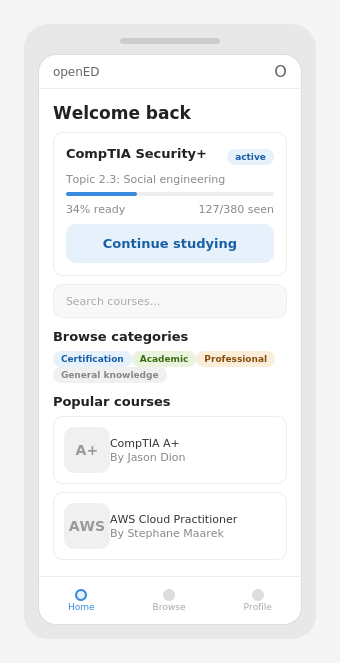

### 10.2 Course Overview
Screen 2: Course detail — metadata, stats, cert info, enroll

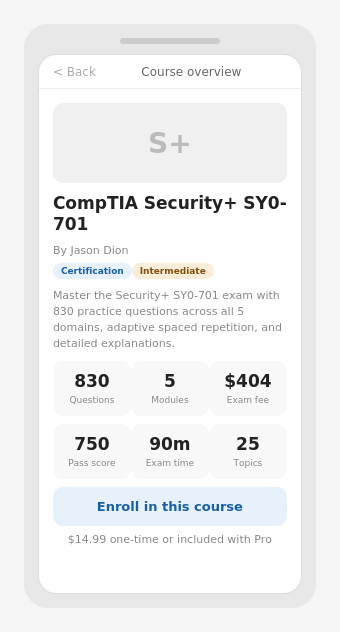

### 10.3 Course Path
Screen 3: Linear path — module headers, topic nodes (completed/current/locked)

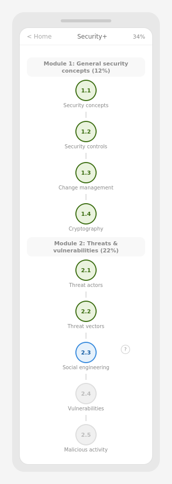

### 10.4 Question Selected
Screen 4: Practice — answer highlighted, Check button active

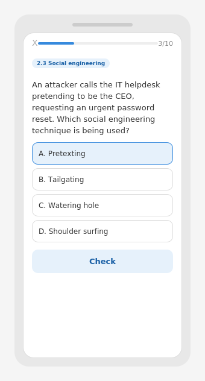

### 10.5 Correct Feedback
Screen 5: Green sheet with explanation always visible

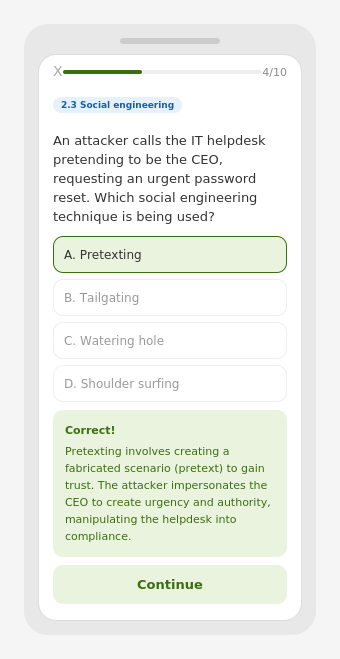

### 10.6 Wrong Feedback
Screen 6: Red sheet — why wrong + why right

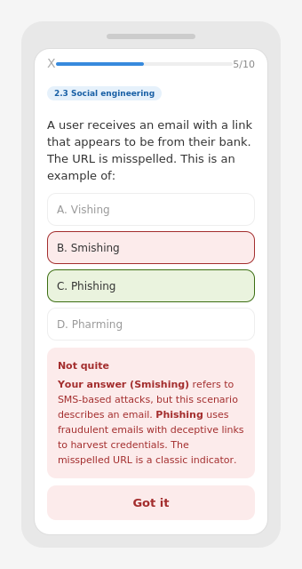

### 10.7 Session Complete
Screen 7: Results — correct/total, readiness delta, topic breakdown

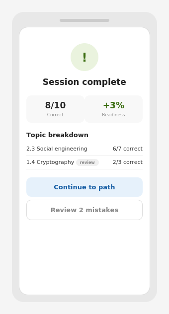

### 10.8 Profile
Screen 8: Completed courses, stats (no active — dashboard owns those)

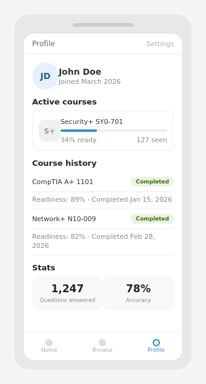

### 10.9 Browse Catalog
Screen 9: Search, category filters, course cards

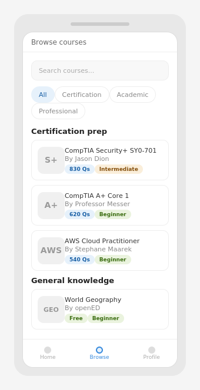

### 10.10 Guidebook Overlay
Screen 10: Guidebook — key concepts, exam tips. Always accessible.

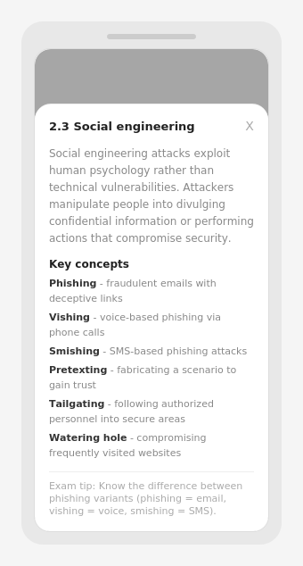

### 10.11 Review Mistakes
Screen 11: Wrong answers with your selection, correct answer, explanation

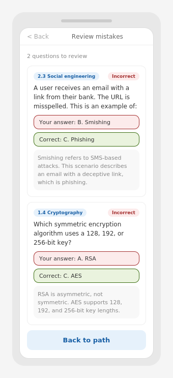

### 10.12 Empty State
Screen 12: New user with no courses

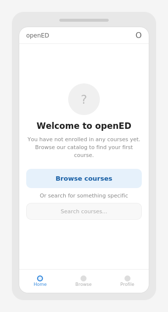

### 10.13 Course Complete
Screen 13: Final readiness, module breakdown, next steps

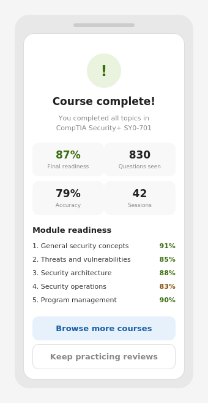

### 10.14 Enrollment
Screen 14: What you get, price, enroll CTA

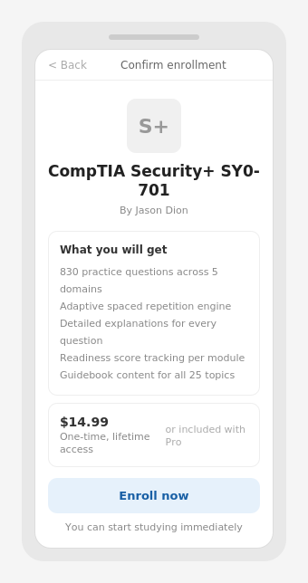

---

## 11. Creator Portal Wireframes (7 Screens)

Desktop web app with sidebar navigation.

### 11.1 Dashboard
Courses, stats, earnings summary

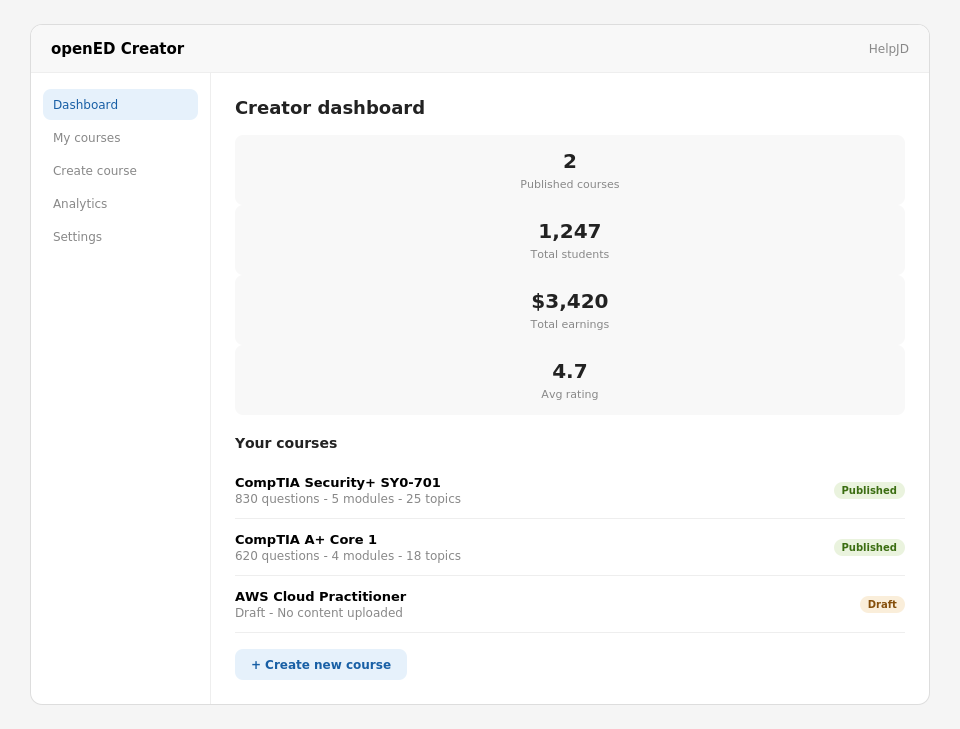

### 11.2 Course Info
Metadata form with cert fields

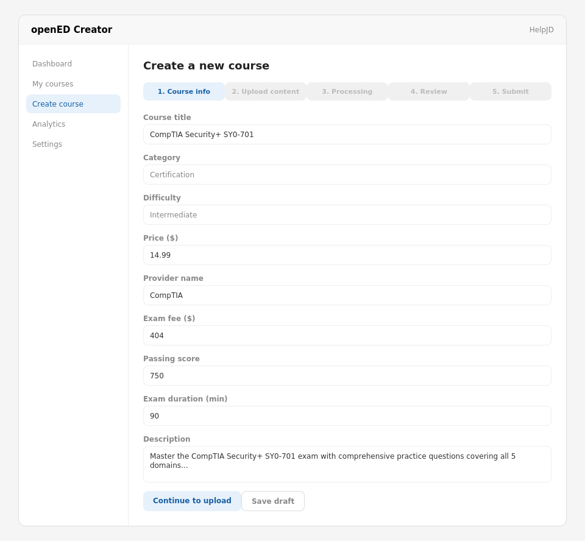

### 11.3 Upload
File drag/drop, uploaded list, templates

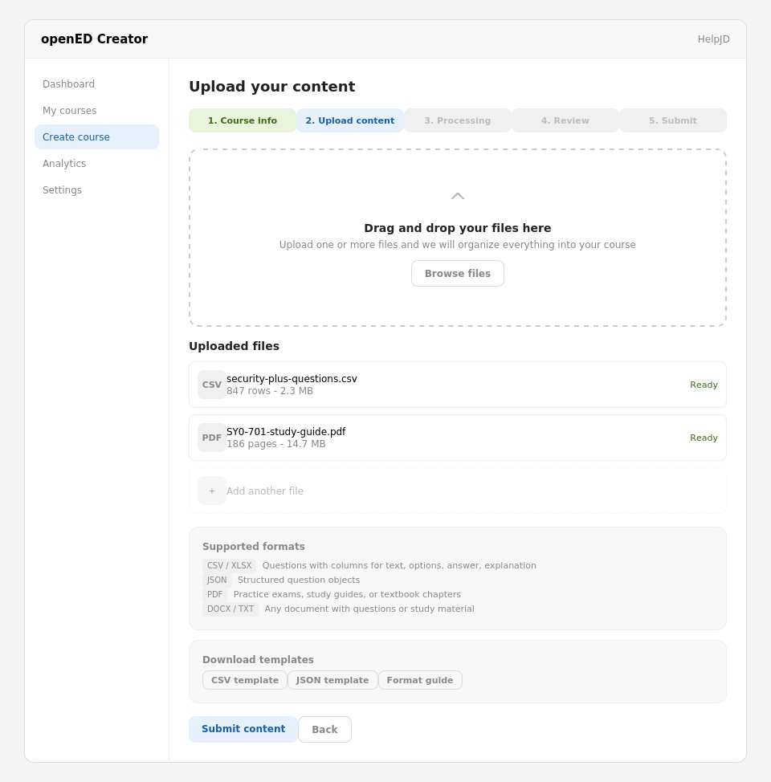

### 11.4 Processing
Progress bar, step status

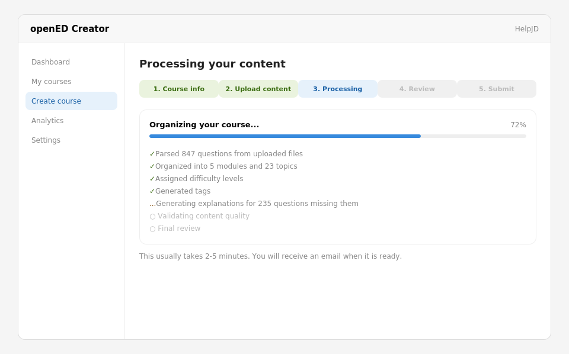

### 11.5 Review
Stats, warnings, structure, editable questions


### 11.6 Submitted
Confirmation, review status

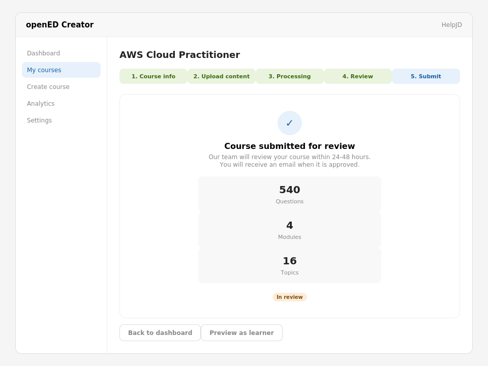

### 11.7 Earnings
Revenue by course, monthly, payouts, settings


---

## 12. API Route Definitions — 28 Routes with Full Request/Response

No custom auth routes. Supabase client SDK handles signup, login, OAuth (Google/Apple/GitHub), logout directly. DB trigger auto-creates profiles row on signup.

### 12.1 Learner — Browse and Enroll (3 routes)

#### `GET /api/courses`

Browse catalog. Powers screens 1, 9.

**Request (query params):**
```
?category=certification&difficulty=intermediate&search=security
&sort=popular&cursor=uuid&limit=20
```

**Response (200):**
```json
{
  "courses": [{
    "id": "uuid",
    "slug": "string",
    "title": "string",
    "description": "string",
    "category": "string",
    "difficulty": "string",
    "thumbnail_url": "string",
    "is_free": true,
    "price_cents": 999,
    "creator": { "id": "uuid", "creator_name": "string" },
    "stats": { "question_count": 50, "module_count": 5, "topic_count": 15 },
    "user_progress": {
      "status": "active",
      "readiness_score": 0.45,
      "questions_seen": 30
    }
  }],
  "next_cursor": "uuid | null",
  "has_more": true
}
```

- Cursor-based pagination for infinite scroll
- `enrolled_count` NOT included for MVP
- `user_progress` inline so dashboard doesn't need separate call

#### `GET /api/courses/:slug`

Course detail. Powers screens 2, 14.

**Response (200):**
```json
{
  "id": "uuid",
  "slug": "string",
  "title": "string",
  "description": "string",
  "category": "string",
  "difficulty": "string",
  "thumbnail_url": "string",
  "is_free": true,
  "price_cents": 999,
  "creator": { "id": "uuid", "creator_name": "string", "bio": "string" },
  "stats": { "question_count": 50, "module_count": 5, "topic_count": 15 },
  "cert_info": {
    "provider_name": "string",
    "provider_url": "string",
    "exam_fee_cents": 39200,
    "passing_score": 750,
    "max_score": 900,
    "exam_duration_minutes": 90,
    "total_questions_on_exam": 90
  },
  "user_progress": {
    "status": "active",
    "readiness_score": 0.45,
    "current_topic_id": "uuid",
    "questions_seen": 30,
    "enrolled_at": "timestamp"
  }
}
```

- Modules NOT at top level — expandable 'Course details' section calls path endpoint

#### `POST /api/courses/:slug/enroll`

Enroll. Powers screen 14.

**Request:** empty body

**Response (201):**
```json
{
  "user_course": {
    "id": "uuid",
    "course_id": "uuid",
    "status": "active",
    "readiness_score": 0.0,
    "current_topic_id": "uuid",
    "enrolled_at": "timestamp"
  }
}
```

- Errors: 409 already enrolled
- Single endpoint — Stripe hooks in Phase 2 behind same button

### 12.2 Learner — Course Path and Progress (5 routes)

#### `GET /api/courses/:slug/path`

Learning path. Powers screen 3.

**Response (200):**
```json
{
  "course_id": "uuid",
  "readiness_score": 0.45,
  "current_topic_id": "uuid",
  "modules": [{
    "id": "uuid",
    "title": "string",
    "weight_percent": 25,
    "display_order": 1,
    "topics": [{
      "id": "uuid",
      "title": "string",
      "display_order": 1,
      "status": "completed | current | locked",
      "questions_seen": 10,
      "questions_total": 15,
      "readiness_score": 0.85,
      "has_guidebook": true
    }]
  }]
}
```

- Topic status computed SERVER-SIDE (single source of truth, no web+mobile sync issues)
- Mastery threshold: ~70% readiness to unlock next topic

#### `GET /api/courses/:slug/guidebook`

Guidebook navigation. Powers screen 10.

**Response (200):**
```json
{
  "current_topic_id": "uuid",
  "modules": [{
    "id": "uuid",
    "title": "string",
    "topics": [{ "id": "uuid", "title": "string", "has_guidebook": true }]
  }]
}
```

- All guidebooks always accessible — no locks. 3-level navigable: Course → Module → Topic
- `current_topic_id` determines landing position when opening

#### `GET /api/topics/:id/guidebook`

Topic guidebook content.

**Response (200):**
```json
{
  "id": "uuid",
  "title": "string",
  "module_id": "uuid",
  "module_title": "string",
  "guidebook_content": "markdown string",
  "prev_topic": { "id": "uuid", "title": "string" },
  "next_topic": { "id": "uuid", "title": "string" }
}
```

#### `GET /api/dashboard`

Home screen. Powers screen 1. Returns active courses ONLY.

**Response (200):**
```json
{
  "active_courses": [{
    "course_id": "uuid",
    "slug": "string",
    "title": "string",
    "creator_name": "string",
    "readiness_score": 0.45,
    "questions_seen": 30,
    "questions_total": 150,
    "current_topic_title": "string",
    "last_session_at": "timestamp"
  }]
}
```

#### `GET /api/profile`

Profile. Powers screen 8. Returns completed courses + stats ONLY. No overlap with dashboard.

**Response (200):**
```json
{
  "user": { "id": "uuid", "display_name": "string", "avatar_url": "string", "created_at": "timestamp" },
  "stats": { "total_questions_answered": 500, "accuracy_percent": 78 },
  "completed_courses": [{
    "slug": "string",
    "title": "string",
    "final_readiness": 0.92,
    "completed_at": "timestamp"
  }]
}
```

### 12.3 Learner — Practice Session (4 routes)

#### `GET /api/session/generate`

Generate 10-question session. Most important endpoint.

**Request:** `?course_id=uuid`

**Response (200):**
```json
{
  "session_id": "uuid",
  "course_id": "uuid",
  "questions": [{
    "id": "uuid",
    "topic_id": "uuid",
    "topic_title": "string",
    "question_text": "string",
    "question_type": "multiple_choice",
    "options": [{ "id": "a", "text": "string" }],
    "difficulty": 3
  }]
}
```

- Correct answers NOT in response — server validates on submit (prevents cheating)
- No pool field exposed to client
- Errors: 404 not enrolled, 422 no questions available

#### `POST /api/session/answer`

Submit answer. Powers screens 5, 6.

**Request:**
```json
{
  "session_id": "uuid",
  "question_id": "uuid",
  "selected_option_ids": ["a"],
  "time_spent_ms": 12400
}
```

**Response (200):**
```json
{
  "is_correct": true,
  "correct_option_ids": ["a"],
  "explanation": "Pretexting involves...",
  "xp_earned": null,
  "fsrs": {
    "rating": 3,
    "next_review_date": "2026-03-21",
    "state": "review"
  }
}
```

- Updates `user_card_states` + inserts `review_log` row
- Errors: 400 invalid IDs, 409 already answered

#### `POST /api/session/complete`

Mark session done. Powers screen 7.

**Request:** `{ "session_id": "uuid" }`

**Response (200):**
```json
{
  "correct_count": 8,
  "total_count": 10,
  "accuracy_percent": 80,
  "readiness_before": 0.34,
  "readiness_after": 0.37,
  "readiness_delta": 0.03,
  "topic_breakdown": [{
    "topic_id": "uuid",
    "topic_title": "string",
    "correct": 6,
    "total": 7,
    "is_review": false
  }],
  "unlocked_topic": { "id": "uuid", "title": "string" }
}
```

#### `GET /api/session/:id/review`

Review mistakes. Powers screen 11.

**Response (200):**
```json
{
  "session_id": "uuid",
  "mistakes": [{
    "question_id": "uuid",
    "topic_title": "string",
    "question_text": "string",
    "question_type": "multiple_choice",
    "options": [{ "id": "a", "text": "string" }],
    "selected_option_ids": ["b"],
    "correct_option_ids": ["c"],
    "explanation": "..."
  }]
}
```

### 12.4 Creator — Application and Profile (3 routes)

#### `POST /api/creator/apply`

**Request:**
```json
{
  "creator_name": "Jason Dion",
  "bio": "15+ years in cybersecurity...",
  "expertise_areas": ["cybersecurity", "comptia", "aws"],
  "credentials": "CISSP, Security+, 2.8M students"
}
```

**Response (201):** `{ "creator_id": "uuid", "status": "pending" }`

- Errors: 409 already applied

#### `GET /api/creator/status`

**Response (200):** `{ "status": "approved", "applied_at": "timestamp", "approved_at": "timestamp" }`

#### `GET /api/creator/dashboard`

**Response (200):**
```json
{
  "creator": { "creator_name": "string", "status": "approved" },
  "stats": {
    "published_courses": 3,
    "total_students": 1200,
    "total_earnings_cents": 450000,
    "avg_rating": 4.7
  },
  "courses": [{
    "id": "uuid",
    "title": "string",
    "status": "published",
    "question_count": 150,
    "module_count": 5,
    "topic_count": 15,
    "student_count": 400,
    "earnings_cents": 150000
  }]
}
```

### 12.5 Creator — Course Management (4 routes)

#### `POST /api/creator/courses`

**Request:**
```json
{
  "title": "string",
  "description": "string",
  "category": "certification",
  "difficulty": "intermediate",
  "is_free": false,
  "price_cents": 1499,
  "provider_name": "CompTIA",
  "provider_url": "https://comptia.org",
  "exam_fee_cents": 39200,
  "passing_score": 750,
  "max_score": 900,
  "exam_duration_minutes": 90,
  "total_questions_on_exam": 90
}
```

**Response (201):** `{ "id": "uuid", "slug": "string", "status": "draft", "created_at": "timestamp" }`

- Slug auto-generated from title
- Errors: 400 missing cert fields, 403 not approved

#### `PATCH /api/creator/courses/:id`

**Request:** any subset of fields from POST

**Response (200):** full updated course object

- Published courses CAN be edited freely (no re-review)

#### `GET /api/creator/courses/:id`

**Response (200):** full course with modules, topics, question counts, warnings

#### `DELETE /api/creator/courses/:id`

**Response (200):** `{ "deleted": true }`

- Errors: 409 can't delete published (archive instead)

### 12.6 Creator — Upload and Processing (3 routes)

#### `POST /api/creator/courses/:id/upload`

**Request:** multipart/form-data with files

**Response (200):**
```json
{
  "uploaded_files": [{
    "id": "uuid",
    "filename": "string",
    "size_bytes": 1024,
    "mime_type": "text/csv",
    "row_count": 150,
    "page_count": null,
    "status": "ready"
  }]
}
```

- Supported: CSV, XLSX, JSON, PDF, DOCX, TXT
- 50MB per file limit, no per-course cap

#### `POST /api/creator/courses/:id/process`

**Request:** empty body — processes all uploaded files

**Response (202):** `{ "process_id": "uuid", "status": "started" }`

- Async processing — client polls status endpoint

#### `GET /api/creator/courses/:id/process/status`

**Response (200):**
```json
{
  "process_id": "uuid",
  "status": "processing | complete | failed",
  "progress_percent": 72,
  "steps": [
    { "name": "Parsing files", "status": "complete" },
    { "name": "Organizing modules/topics", "status": "complete" },
    { "name": "Assigning difficulty", "status": "complete" },
    { "name": "Generating tags", "status": "complete" },
    { "name": "Generating explanations", "status": "in_progress" },
    { "name": "Validating quality", "status": "pending" },
    { "name": "Final review", "status": "pending" }
  ],
  "result": {
    "questions_parsed": 150,
    "modules_created": 5,
    "topics_created": 15,
    "warnings": [],
    "flagged_questions": []
  },
  "error": null
}
```

### 12.7 Creator — Review, Publish, and Earnings (4 routes)

#### `GET /api/creator/courses/:id/review`

**Response (200):**
```json
{
  "course_id": "uuid",
  "title": "string",
  "status": "draft",
  "stats": {
    "total_questions": 150,
    "total_modules": 5,
    "total_topics": 15,
    "flagged_questions": 3,
    "warnings": 2
  },
  "warnings": [{ "type": "string", "message": "string", "topic_id": "uuid" }],
  "modules": [{
    "id": "uuid",
    "title": "string",
    "weight_percent": 25,
    "topics": [{
      "id": "uuid",
      "title": "string",
      "question_count": 10,
      "has_guidebook": true
    }]
  }],
  "sample_questions": [{
    "id": "uuid",
    "topic_title": "string",
    "question_text": "string",
    "question_type": "multiple_choice",
    "options": [],
    "explanation": "string",
    "difficulty": 3,
    "tags": ["encryption"],
    "source": "creator_original"
  }]
}
```

#### `PATCH /api/creator/questions/:id`

**Request:** any subset — `question_text`, `options`, `explanation`, `difficulty`

**Response (200):** full updated question

#### `POST /api/creator/courses/:id/submit`

**Request:** empty body

**Response (200):** `{ "course_id": "uuid", "status": "in_review", "submitted_at": "timestamp" }`

- Validates minimums (10 Qs/topic, 3 topics/module, 50 Qs/course)
- Errors: 400 with array of validation issues

#### `GET /api/creator/earnings`

Combined earnings + payouts (single endpoint).

**Response (200):**
```json
{
  "lifetime_earnings_cents": 450000,
  "this_month_cents": 35000,
  "pending_payout_cents": 35000,
  "total_paid_out_cents": 415000,
  "by_course": [{
    "course_id": "uuid",
    "title": "string",
    "student_count": 400,
    "gross_revenue_cents": 600000,
    "creator_share_cents": 450000,
    "status": "published"
  }],
  "monthly": [{
    "month": "2026-03",
    "course_sales_cents": 50000,
    "pro_share_cents": 15000,
    "total_cents": 65000
  }],
  "payouts": [{
    "date": "2026-02-28",
    "amount_cents": 125000,
    "period": "2026-02",
    "status": "paid"
  }]
}
```

### 12.8 Admin — Internal (5 routes)

#### `GET /api/admin/creators/pending`

**Response:** `{ "creators": [{ "id", "user_id", "creator_name", "bio", "expertise_areas", "credentials", "applied_at" }] }`

#### `PATCH /api/admin/creators/:id/approve`

**Response:** `{ "id", "creator_name", "status": "approved", "approved_at" }`

#### `GET /api/admin/courses/pending`

**Response:** `{ "courses": [{ "id", "title", "creator_name", "category", "question_count", "module_count", "topic_count", "warnings", "submitted_at" }] }`

#### `PATCH /api/admin/courses/:id/approve`

**Response:** `{ "id", "title", "status": "published", "published_at" }`

#### `PATCH /api/admin/courses/:id/reject`

**Request:** `{ "reason": "string" }`

**Response:** `{ "id", "status": "draft", "rejection_reason": "string", "rejected_at": "timestamp" }`

---

## 13. Business Model (Locked)

### 13.1 Pricing

| Tier | Price | What you get |
|------|-------|-------------|
| Free | Free forever | Foundational education (math, science, geography) |
| Per-course | $9.99-$19.99 one-time | Lifetime access to one course |
| Pro Monthly | $14.99/month | All courses, all features |
| Pro Annual | $99/year ($8.33/mo) | Same as monthly, anchor price |
| Enterprise | $15-$25/user/month | Team dashboards, compliance, SSO |

### 13.2 Creator Revenue Share

| Attribution | Creator | Platform |
|------------|---------|----------|
| Creator-referred sale | 80% | 20% |
| Platform-discovered sale | 60% | 40% |
| Pro subscription pool | 70% | 30% |
| Enterprise | 50% | 50% |

- **Founding Creator Program:** 80/20 split permanently locked, advisory input, equity consideration top 3-5

---

## 14. Financial Plan

| Decision | Choice |
|----------|--------|
| Funding strategy | Bootstrap to $1-2M ARR, then Series A |
| Year 1 costs | $1,320-$3,960/year |
| Break-even | Month 4-6 (30-50 course purchases) |
| Infrastructure at launch | Under $50/month |

---

## 15. Go-to-Market

**Creator recruitment targets:**
- Jason Dion (2.8M enrollments), Professor Messer (1M+), Mike Meyers (1M+)
- Stephane Maarek (2.5M+), Neil Anderson (600K+), Tutorials Dojo (1M+)

**The pitch:**
You already have the content. Zero exclusivity, zero risk. Upload existing questions, earn 70-80% of every sale.

**Proof needed:**
Working Loom demo showing their actual content in gamified format — not a pitch deck.

---

## 16. MVP Scope — Tiered

**Tier 1 (product doesn't exist without this):**
- Auth, creator apply/approve, creator uploads course, learner enrolls, FSRS engine, answer submission, progress tracking, readiness score, course review workflow

**Tier 2 (real product feel):**
- Streaks, XP, daily goals, session completion with feedback, onboarding flow, course browse

**Tier 3 (engagement and growth):**
- Achievements, leagues, Career GPS, study sprints, push notifications

---

## 17. Competitive Landscape

| Platform | Strength | Weakness | OpenED advantage |
|----------|----------|----------|-----------------|
| Duolingo | Gamification, habit loops | No creators, no cert prep | Creator marketplace + certs |
| Quizlet | Fast content creation | Basic algorithm, paywall backlash | FSRS algorithm, fair pricing |
| Pocket Prep | Cert-focused, explanations | Static, no gamification | Gamification + marketplace |
| Kahoot | Engagement, game feel | No spaced repetition | FSRS + deep explanations |
| Anki | Best algorithm (FSRS) | Terrible UX | Duolingo-grade UX |
| Brilliant | Interactive, no-video | STEM only, no creators | All categories + creators |
| Udemy | Huge creator base | Declining rev share, passive | 70-80% share, active learning |
| Go1 | Enterprise, $2B valuation | No gamification, passive | Engagement layer they lack |

---

## 18. Research Completed

| Report | Key finding |
|--------|------------|
| Competitive landscape (8 platforms) | No platform combines gamification + spaced repetition + creator marketplace |
| Practice session UX (5 platforms) | Duolingo confirm model + Pocket Prep explanations + Brilliant wrong-answer specificity |
| Duolingo content structure | 6-layer hierarchy, ~15 exercises per lesson, linear path redesign |
| Udemy/Coursera creator flows | Udemy: open creator + course review. Published courses freely editable. |
| Khan Academy partnership | Very low feasibility — CC BY-NC-SA blocks commercial use |
| Go1 enterprise analysis | Content aggregator, not competitor. Validates enterprise learning market. |
| USPTO trademark search | OpenED has LIVE PENDING mark in Class 041. OPENEDUCATION filed Classes 009, 041, 042. |

---

## 19. Key Design Decisions Log

| Decision | Choice | Rationale |
|----------|--------|-----------|
| Auth | Supabase client SDK directly | No custom wrappers needed for MVP |
| Pagination | Cursor-based | Better for infinite scroll, no stale pages |
| enrolled_count on course cards | Removed for MVP | Low numbers look bad early on |
| Dashboard vs Profile | Dashboard = active courses. Profile = completed + stats. | No overlap, clean data split |
| Topic status computation | Server-side | Single source of truth, no web+mobile sync issues |
| Guidebook accessibility | Always accessible, never locked | 3-level nav: Course → Module → Topic |
| Enroll endpoint | Single endpoint for free + paid | Stripe hooks in Phase 2 behind same button |
| Published course editing | Free editing, no re-review | Matches Udemy policy. Guardrails later if needed. |
| File upload limits | 50MB per file, no course cap | Infrastructure costs acceptable |
| Earnings + payouts endpoint | Combined into one | Same wireframe screen, one call |
| Session pool field | Not exposed to client | is_review flag on topic_breakdown handles tagging |
| Correct answer in generate | Excluded | Server validates on submit, prevents cheating |
| FSRS vs SM-2 | FSRS v5 | 15-30% more efficient, eliminates ease hell |
| Path vs FSRS relationship | Path = topic mastery, FSRS = question scheduling | Operate at different levels, don't conflict |
| Creator table row creation | Created on apply (pending), not on approve | Row needed to track application status |
| Content creation | File upload only, no paste | Courses are too large for paste. External authoring. |

---

## 20. Open Questions and Remaining Work

### 20.1 Blocking — Must Resolve Before Build

| Item | Detail |
|------|--------|
| Company name / domain | OpenED has LIVE PENDING trademark (Class 041) by Ready Force Cyber Ventures. Openedu Inc owns openedu.ai, openedu.com, openedu.net and filed OPENEDUCATION across Classes 009, 041, 042. Must pick new name. |
| Admin dashboard wireframes | 5 admin API routes defined but no UX spec |

### 20.2 Needs Wireframe Update

| Item | Detail |
|------|--------|
| Guidebook 3-level navigation | Decided Course → Module → Topic nav. Current wireframe shows old single overlay. |
| Course overview expandable section | Modules/weights behind expandable accordion. Not wireframed. |

### 20.3 Deferred — Phase 2+

| Item | Detail |
|------|--------|
| AI pipeline spec | Input formats → Claude prompts → output validation → error handling |
| Mobile architecture | @opened/core package structure, Expo config, EAS build |
| Stripe / payments | Enroll routes through Stripe Checkout. Webhook flow. Creator payouts. |
| Push notifications | Tier 3. Expo Push + Supabase scheduled function. |
| Onboarding wizard | Tier 2. 3-step flow for new learners. |
| Dark mode | Tier 2. Default dark planned. |

### 20.4 Completed

| Item | Resolution |
|------|-----------|
| Database schemas (9 tables) | Section 8 |
| API routes (28 total) | Section 12 with full request/response |
| Learner wireframes (14 screens) | Section 10 |
| Creator wireframes (7 screens) | Section 11 |
| Practice session flow | Section 9 |
| FSRS algorithm + session generation | Section 6 |
| Content structure (4 levels) | Section 4 |
| Creator flow (two gates) | Section 7 |
| Business model + pricing | Section 13 |
| Competitive landscape (8 platforms) | Section 17 |
| All design decisions | Section 19 |

---

*End of specification v4.0 — This is a living document.*
